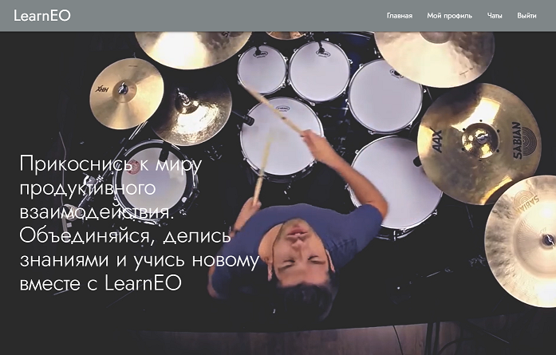

# Добро пожаловать в репозиторий проекта LearnEO!

Ссылка на проект на Heroku:
https://learn-each-other.herokuapp.com/

LearnEO (Learn Each Other) - приложение, собравшее в себе людей, объединённых одной идеей: безвозмездно делиться друг с другом знаниями.

# На LearnEO вы можете:

  - Указать знания и навыки, которым вы хотите обучиться и которым вы можете обучить других
  - Найти по совпадениям навыков тех, кто мог бы вас чему-то обучить
  - Найти тех, кто хотел бы чему-то научиться у вас

# Объединяйтесь. Учитесь.

> It always seems impossible.
> Until it's done.
